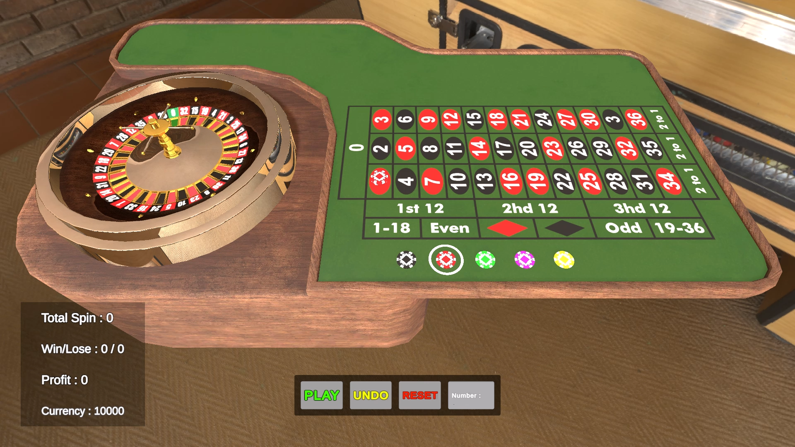
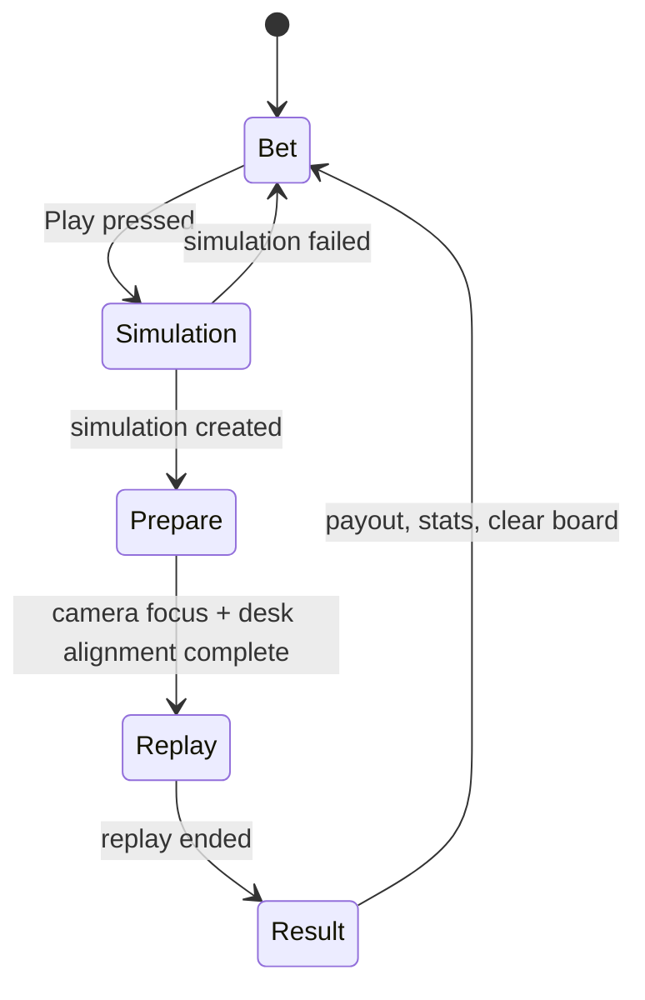
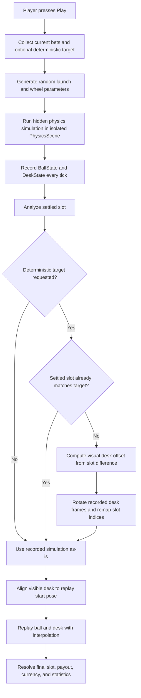
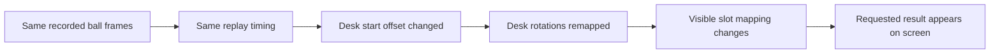

# Joker Games Deterministic Roulette Case Study

A Unity 6 roulette prototype built around a deterministic simulation and replay pipeline. The core idea is to separate hidden physics simulation from visible presentation, so the round can be simulated first, recorded frame-by-frame, and then replayed smoothly with interpolation. When deterministic mode is requested, the system does not try to "cheat" the live physics mid-spin. Instead, it predicts the landing slot before the visible round begins, adjusts the visual desk start offset, and replays the same recorded simulation so the representation reaches the requested result.

## Demo Video

[](https://drive.google.com/file/d/1FT4A_5Fy2aEA2T8H001NCEhckGYmMKuY/view?usp=sharing)

## Project Summary  
- Engine: Unity `6000.3.11f1`
- Scene: `Assets/Project/Scenes/Gameplay.unity`
- Roulette type: single-zero / European wheel (`0-36`, total `37` slots)
- Main focus areas:
  - clickable betting board
  - command-based bet placement, undo, and reset
  - deterministic outcome selection through numeric input
  - hidden physics simulation in an isolated `PhysicsScene`
  - replay interpolation for smooth presentation
  - persistent balance, statistics, bet board, and resumable post-game state

## How To Run

1. Open the project in Unity `6000.3.11f1`.
2. Load `Assets/Project/Scenes/Gameplay.unity`.
3. Press Play in the editor.

## Controls And Gameplay Instructions

### Main Player Flow

1. Select a chip by clicking one of the chip areas on the table UI.
2. Click any valid bet area on the board to place the selected chip.
3. Optionally type a deterministic roulette number into the deterministic input field.
4. Press `Play` to start the round.
5. The game switches from betting to simulation, aligns the roulette desk to the replay start pose, and then plays the recorded result.
6. After replay ends, payouts, currency, and statistics are updated, and the game returns to the betting state.

### UI Interactions

- `Chip click`: selects a stake value.
- `Click the same chip again`: deselects that chip.
- `Bet area click`: places the currently selected chip on that area.
- `Play`: starts a normal round, or a deterministic round if a valid number is entered.
- `Undo`: removes the last placed bet via command history.
- `Reset`: clears all current bets by undoing all tracked commands.
- `Deterministic input`: numeric-only field intended for roulette numbers `0-36`.

### Deterministic Outcome Selection

- Runtime UI currently supports deterministic selection by exact roulette number.
- If the input contains non-digit characters, the field is cleared by the controller.
- If the entered value does not resolve to a valid roulette number, the game falls back to a normal random round and logs a warning.
- During `Prepare` and `Replay`, operation buttons and deterministic input are disabled to prevent desynchronization.

### Keybindings And Special Interactions

- There are currently no dedicated keyboard shortcuts in gameplay.
- Interaction is pointer/mouse-driven.
- Camera movement is automatic:
  - betting state focuses the table/bet view
  - replay preparation focuses the roulette wheel
  - after replay ends, camera returns to the betting focus

### Editor-Only Debug Utilities

The custom inspector for `RouletteGame` includes quick test buttons for:

- starting a random game
- starting a deterministic game to number `13`
- starting deterministic color-based tests for `Black`, `Red`, and `Green`
- opening saved JSON files
- deleting all saved game data

## Gameplay State Flow

The round loop is controlled by a custom HFSM-based state machine:



### What Each State Does

- `Bet`: player selects chips and places bets.
- `Simulation`: the system creates the hidden physics result and records frame data.
- `Prepare`: the visible scene is aligned to the first replay frame and camera focus changes.
- `Replay`: ball and desk replay the recorded simulation using interpolation.
- `Result`: the final slot is resolved, bets are evaluated, balance/statistics are updated, and the board is reset for the next round.

## Deterministic Simulation

### Core Idea

This prototype intentionally separates:

1. physical truth
2. recorded simulation data
3. visible presentation

That separation is what makes the deterministic mode possible.

- First, the game runs the roulette spin in a hidden simulation scene.
- Then it analyzes where the ball physically settled.
- If no deterministic target was requested, the result is replayed exactly as simulated.
- If a deterministic target was requested, the system keeps the same simulation frames but rotates the desk representation so the visible result maps to the requested slot.
- Finally, the replay system interpolates the stored frames to produce the on-screen animation.

In short: the simulation can stay the same while the representation is remapped to reach the desired visible outcome.

### High-Level Pipeline



### Detailed Technical Explanation

#### 1. Hidden simulation happens before visible gameplay playback

When the player presses `Play`, `RouletteGame` transitions to the `Simulation` state. At this point the visible wheel does not yet start the final presentation spin. Instead, `PhysicSimulator` creates or reuses a separate local physics scene and runs the round there.

The simulator generates:

- ball launch direction
- ball launch force
- wheel spin speed
- wheel drag
- wheel start angle

Then it:

- starts the wheel spin
- waits for spin ease-in to complete
- launches the ball from the desk launch transform
- advances physics manually using scripted simulation ticks
- records `BallState` and `DeskState` arrays frame-by-frame
- checks slot overlap on every iteration
- stops once the wheel is no longer spinning and the ball has come to rest, or the max iteration count is reached

#### 2. The system predicts where the ball settled

After the hidden simulation finishes, the simulator inspects the recorded slot indices and finds the final settled slot. This becomes the physical result of the round.

If the player did not request a deterministic target, this physical result is used directly.

#### 3. Deterministic mode remaps presentation, not the physical path

If the player requested a deterministic number:

- the simulator compares the physically settled slot with the desired slot
- if they already match, replay stays unchanged
- if they do not match, the system computes the slot difference and converts that into a wheel rotation offset

The key formula is:

```text
slotAngle = 360 / slotCount
slotIndexDifference = desiredSlotIndex - sourceSlotIndex
visualDeskOffset = -(slotIndexDifference * slotAngle)
```

Then the simulator creates a new replay state:

- ball positions and ball rotations stay exactly the same
- desk rotations are rotated by the visual offset
- recorded slot indices are remapped to the new visual slot positions
- `FinalSlotInfo` is replaced with the desired visual slot

This means the prototype does not recompute a new physical reality for the deterministic target. Instead, it preserves the same recorded motion and changes the desk representation layer so the final visible mapping reaches the requested number.

That is the intended tradeoff:

- physics remains stable and replayable
- deterministic presentation becomes controllable
- the visible result can be forced without destabilizing the live simulation

### Representation And Replay Logic

Before replay begins, the visible desk is aligned to the first desk frame from the stored replay. This avoids a visible jump between betting view and replay start.

After alignment:

- the wheel and the ball both start replay from the recorded arrays
- `SimulationReplayPlayer<TState>` advances replay time using the stored tick duration
- the system interpolates between frames for smoother visual output

Interpolation uses:

```text
alpha = (replayTick - fromIndex) * interpolationFactor
position = Lerp(fromState.position, toState.position, alpha)
rotation = Slerp(fromState.rotation, toState.rotation, alpha)
```

So even though the stored simulation remains discrete, the visible replay is smoother and more readable.

### Deterministic Replay Mental Model



### Why This Approach Was Chosen

- It keeps the hidden simulation deterministic and recordable.
- It avoids trying to intervene in unstable live physics after the round starts.
- It makes replay resumable because the entire round is stored as frame data.
- It gives a controlled case-study solution for "desired outcome" behavior without rebuilding the whole physics stack.

## Architecture And Design Patterns

The project combines several patterns intentionally. Not every common pattern was used; only the ones that fit the problem.

| Pattern | Where It Appears | Why It Fits |
| --- | --- | --- |
| `State / HFSM` | `RouletteGame`, `Bet`, `Simulation`, `Prepare`, `Replay`, `Result` | The round lifecycle is stateful and has strict transitions. This keeps the game loop explicit and easy to reason about. |
| `MVC / MVCS-style UI separation` | `DeskSystem`, `OperationTabSystem`, `StatisticsSystem` with `Model`, `View`, `Controller` classes | UI input, data, and rendering updates are separated so the gameplay layer is not buried inside MonoBehaviours. |
| `Command` | `CommandManager`, `ICommand`, `PlaceBetCommand` | Bet placement must support undo and full reset. Command history makes those behaviors predictable. |
| `Observer / Event-driven communication` | `EventBus<T>`, `Observable<T>`, replay callbacks | UI, camera, stats, and game flow can react to changes without hard wiring everything together. |
| `Singleton` | `CurrencyManager.Instance`, `MonoBehaviourSingleton<T>` base | Balance management is centralized and persistent across the session. |
| `Adapter` | `ISimulationReplayAdapter<TState>`, `BallReplayAdapter`, `DeskReplayAdapter` | Replay logic is generic while object-specific state application is delegated per simulation object. |

### Pattern Notes

- `Command` is especially important because it makes `Undo` and `Reset` trivial and keeps bet mutations reversible.
- `Observer` is used in two layers:
  - `EventBus<T>` for game-wide events
  - `Observable<T>` for model-to-view/controller synchronization
- `State` is the backbone of the round loop.
- `Adapter` makes the replay player reusable for both the ball and the wheel.
- A full `Factory` pattern was not introduced because object construction is still simple enough to remain explicit.

## Persistence And Recoverability

The prototype persists runtime data under `Application.persistentDataPath`.

### Stored Data

- `GameData.json`
  - currency amount
  - overall statistics
- `PostGameData.json`
  - resumable simulation data for in-progress rounds
- `BetBoardData.json`
  - currently placed bets on the board

### What This Enables

- currency survives between sessions
- statistics survive between sessions
- open bet board state can be restored
- if the application stops during `Simulation`, `Prepare`, or `Replay`, the stored simulation can be resumed instead of recomputed

## Relevant Project Structure

```text
Assets/Project/Scenes/Gameplay.unity
Assets/Project/Scripts/Roulette/Game/
Assets/Project/Scripts/Roulette/Simulation/
Assets/Project/Scripts/Roulette/Ball/
Assets/Project/Scripts/Roulette/Desk/
Assets/Project/Scripts/GUI/Desk/
Assets/Project/Scripts/GUI/Operations/
Assets/Project/Scripts/GUI/Statistics/
Assets/Project/Scripts/BetManagement/
Assets/Project/Scripts/Command/
Assets/Project/Scripts/EventBus/
Assets/Project/Scripts/SessionManagement/
```

## Known Issues

- Demo link is still a placeholder and should be replaced before submission.
- Win/lose result presentation is currently minimal; the `Result` state logs to the console and still has TODOs for proper UI/VFX/SFX feedback.
- Deterministic mode is a representation-layer remap, not a physically re-solved forced landing. That is intentional, but it should be clearly understood as a design tradeoff.
- Invalid deterministic numbers only warn in logs and fall back to random play instead of showing user-facing validation feedback.
- There are no dedicated gameplay keyboard shortcuts yet.
- Automated tests are currently missing.

## Future Improvements

- Add a proper result panel with payout breakdown, winning bet highlights, and end-of-round feedback.
- Add user-facing validation and helper text for deterministic input.
- Extend runtime deterministic options beyond exact number input:
  - red / black
  - even / odd
  - low / high
  - dozens / columns
- Add automated tests for:
  - payout calculation
  - slot remapping logic
  - persistence loading/saving
  - replay interpolation edge cases
- Add a lightweight debug overlay that shows:
  - physical slot
  - requested deterministic slot
  - applied desk offset
  - replay frame count
- Improve data inspection and export workflows for case-study review.

## Final Note

The most important implementation detail in this prototype is the deterministic replay approach:

the round is simulated first, the landing slot is predicted, the wheel's visible starting offset is adjusted, and then the same recorded simulation is replayed with interpolated frames. Because of that separation, the physical simulation can stay stable while the visible representation reaches the requested outcome.
